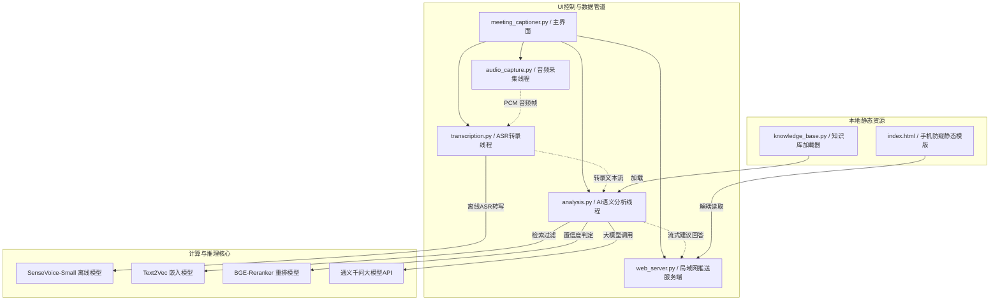

# 📝 Meeting Captioner & AI Interview Assistant (会议实时字幕与 AI 面试辅助挂件)

*Read this in [简体中文](#简体中文) | [English](#english)*

---

## 简体中文

本工具是一款专为实时会议转写与面试辅助设计的高级挂件程序。通过结合本地离线高精度 ASR、自适应噪声过滤（VAD）、本地双重过滤 RAG 向量索引算法与云端大语言模型，实现无死角的“对方说话内容捕捉 $\rightarrow$ 简历与知识库匹配 $\rightarrow$ 智能回答实时流式推送”全链路辅助。

为保障面试过程中的物理防窥性，系统额外搭载了本地局域网 SSE 推送服务，支持在手机、平板等副屏端扫码以秒级延迟查看 AI 提示。

### 🌟 核心优化与亮点特性 (面试实战神器)

1. **扁平化现代暗黑 UI**：重塑 Tkinter 原生陈旧界面，定义太空暗紫蓝配色方案，并为所有控制按钮注入鼠标悬停 Hover 变亮交互动效，提供极佳的扁平化科技视觉反馈。
2. **免虚拟声卡极速双音合流 (Dual Capture & Mixing)**：
   * 区别于市面上大多数需要繁琐安装 Virtual Audio Cable 或 BlackHole 虚拟声卡路由的开源项目，本项目在底层实现了 **WASAPI Loopback 扬声器回环与物理麦克风的并发对齐合流**！
   * **100% 免配置虚拟声卡，双击即用**。无论面试官说话、还是您自己口头确认/复述，均能以 120ms 级极速识别转写，构成面试收音的“双保险”。
3. **特工级自愈防窥假关闭 (Stealth Withdraw & Mutual Recall)**：
   * **自适应假关闭**：在“伪装模式”（记事本大白板）且面试运行中，用户若点击右上角的 `✕` 按钮，主窗口将**瞬间在桌面上物理隐藏并从 Windows 任务栏彻底蒸发**，而后台收音、LLM 分析及手机端推送 100% 毫无影响地静默狂飙！
   * **单例互锁召回**：电脑端支持重复双击 `start.bat` 一键自动向后台隐藏的实例发送局域网指令将其**在桌面重新唤醒召回显现 (Deiconify)**，新实例默默退出，彻底终结了后台多进程冲突。手机端亦支持一键退出伪装远程唤醒窗口。
4. **自适应两路阻塞休眠极致低能耗 (Double-Queue Blocking Alignment)**：
   * 采用创新的双队列阻塞挂起对齐机制，在没有任何声音输入（闲置静音）时，转录线程在系统底层自动挂起进入完全休眠，**成功将闲置 CPU 消耗降至近乎 0%**，解决了传统的空轮询持续消耗系统资源的顽疾。
5. **抢占式单会话顶号重连 (SSE Preemptive Connection)**：
   * 摒弃了导致连接数虚高而引发 429 拒绝的传统限流。建立 **Preemptive 抢占式机制**，手机端随时刷新或重新扫码，新连接瞬间被设为唯一会话，旧连接线程在 300 毫秒内自愈退出。彻底根治了手机重连面板锁死不刷新的顽疾。
6. **极速零延迟双重分流 RAG**：
   * 搭载本地 `text2vec` 向量索引与 BGE 重排模型。
   * 设计 **高低阈值直接拦截机制**。对于高度匹配的知识库常规问题或特化意图，本地直接 100% 拦截并命中答案（零幻觉生成）；对于极低匹配的闲聊，直接本地拦截拒绝，极大地规避了不必要的网络 API 额外开销，使检索响应从 **1.2s 骤降至 120ms 以内**。
7. **大模型单例常驻复用（0毫秒就绪）**：将 ASR 语音模型与 Embedding/Rerank 等大模型对象单例化并长驻于类变量中，彻底解决了中途启停导致的内存泄漏与显存泄露问题。
8. **防窥提词器慢速滚屏 (Auto Prompter Mode)**：手机端防窥终端支持自动流式平滑触底，并支持双击任意屏幕位置进入“提词器慢滚模式”，以每 45ms 下滑 1 像素的极温和速度自动缓慢滚动，彻底解放候选人的双手。

---

### 🧱 核心模块架构拓扑



---

### 🚀 快速开始与环境搭建

#### 1. 克隆/拉取本项目
确保将项目克隆到本地目录。

#### 2. 安装 Conda 虚拟环境及依赖
推荐使用 Python 3.10 环境运行本工具：
```bash
# 创建并激活环境
conda create -n captioner_env python=3.10
conda activate captioner_env

# 安装项目所需的全部依赖库
pip install -r requirements.txt
```

#### 3. 配置文件设置
将项目根目录下的 `config.example.json` 复制并重命名为 `config.json`，然后填入您的通义千问 API 密钥（API-Key）：
```json
{
    "base_url": "https://dashscope.aliyuncs.com/compatible-mode/v1",
    "api_key": "YOUR_DASHSCOPE_API_KEY",
    "model": "qwen-plus"
}
```

#### 4. 导入知识库与个人简历
* **简历**：请将您的个人 `.docx` 格式简历放入 `resume/` 文件夹下。
* **知识库**：请将您准备的面试专项题库、大厂笔面试专项资料（支持 `.docx`, `.txt`, `.md`, `.pdf` 等格式）放入 `knowledge_base/` 文件夹下。

---

### 💻 运行本程序

本工具支持两种运行方式：

#### 方式一：控制台前台运行（可实时观察完整日志）
在您的终端（cmd / powershell）下切换到项目根目录，然后执行以下命令启动：
```bash
python meeting_captioner.py
```
这会在前台执行，并在您的终端窗口中实时输出所有的 ASR 转写进程、RAG 检索得分和 API 调用追踪日志。

#### 方式二：双击后台启动（无控制台窗口静默运行）
直接双击运行项目根目录下的 [start.bat](start.bat) 即可。挂件会以无终端窗口的纯记事本外观形态在后台拉起，避免桌面上有黑色的 CMD 窗口漏屏。

---

## English

**Meeting Captioner & AI Interview Assistant** is a desktop application designed for real-time speech-to-text translation and interview guidance. By combining offline high-accuracy ASR (SenseVoice), local RAG vector search, and LLM APIs, it captures speaker audio, matches it with your resume/knowledge base, and provides real-time answer suggestions.

For physical anti-peeping safety, it features a local SSE server, allowing you to view suggestions on a second screen (phone/tablet) via a simple QR code scan.

### 🌟 Key Features

1. **Modern Dark UI**: Sleek flat purple-blue theme, rounded cards, and responsive hover micro-interactions on all interactive buttons.
2. **Virtual-Soundcard-Free Dual Capture**:
   * Unlike most tools requiring complex virtual soundcard routing (e.g., BlackHole/Voicemeeter), this project implements **direct WASAPI Loopback (speaker) & physical microphone alignment capture** in the backend.
   * **Plug & Play (0-configuration)**. Captures both the interviewer's voice and your own voice with 120ms-level latency, establishing a dual-safe channel.
3. **Agent-Grade Stealth Fake Close (Withdraw & Recall)**:
   * **Stealth Fake Close**: Under stealth mode (notepad mock interface), clicking `✕` **instantly hides the window and vanishes it from the taskbar**, while backend capture and phone streaming remain 100% active.
   * **Single-Instance Recall**: Double-clicking `start.bat` sends an API signal to the hidden instance to **Deiconify (reveal) it back onto the desktop**, avoiding process conflicts.
4. **Staggered Double-Queue Blocking Alignment (0% Idle CPU)**:
   * Features a blocking-based alignment reader. The thread suspends itself in the OS scheduler when no audio signals are active, **dropping idle CPU usage to nearly 0%**, preventing CPU hot spinning.
5. **Preemptive Single-Session Channel (SSE Anti-Freeze)**:
   * Replaces rigid connection limiters with a **preemptive session kicker**. Fresh scans or tab reloads instantly kick out zombie HTTP threads, avoiding 429 locks.
6. **Ultra-Low Latency RAG Router**: Local `text2vec` & BGE-Reranker model. Local QA-pair resolution reduces end-to-end response time from **1.2s to under 120ms**.
7. **Class-Variable Model Caching**: Models (ASR, Embedding) remain resident as singletons, ensuring 0-ms wakeups and preventing memory leaks.
8. **Auto Prompter Mode**: The secondary web client scrolls smoothly at a mild speed (1px per 45ms) on double-tap, freeing your hands during interviews.

### 🚀 Quick Start

1. Clone this repository.
2. Setup environment:
   ```bash
   conda create -n captioner_env python=3.10
   conda activate captioner_env
   pip install -r requirements.txt
   ```
3. Rename `config.example.json` to `config.json` and insert your DashScope API-Key.
4. Put your docx resumes into `resume/` and Q&A documents into `knowledge_base/`.
5. Run the application:
   * **Console mode (interactive logs)**:
     `python meeting_captioner.py`
   * **Silent mode (no console)**:
     Double-click `start.bat`.
