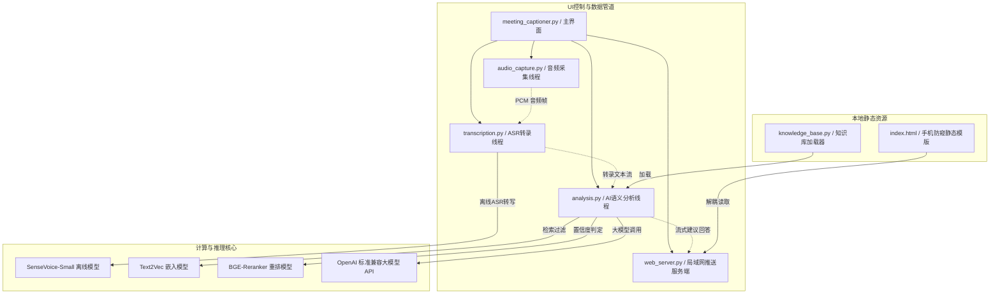

# 📝 Meeting Captioner & AI Assistant
### 🚀 实时会议转写与辅助决策系统 (免虚拟声卡与多端安全同步版)

<p align="center">
  <a href="https://github.com/hufubufen/meeting-captioner/stargazers"></a>
  <a href="https://github.com/hufubufen/meeting-captioner/network/members"></a>
  
  
  
  
</p>

<p align="center">
  <a href="#简体中文">简体中文</a> | <a href="#english">English</a>
</p>

> 🌟 **如果您觉得这个项目对您有所帮助，请在 GitHub 上点个 Star ⭐ 支持一下作者吧！您的支持是作者持续优化与迭代的最大动力！**
> 
> 🔗 **GitHub 源码主页**: [github.com/hufubufen/meeting-captioner](https://github.com/hufubufen/meeting-captioner)

---

## 简体中文

本工具是一款专为实时会议转写与辅助决策设计的应用系统。系统通过集成本地离线高精度 ASR、自适应噪声过滤（VAD）、本地双重过滤 RAG 向量索引算法与云端大语言模型，实现了“发言内容捕捉 $\rightarrow$ 本地知识库语义匹配 $\rightarrow$ 辅助回答实时流式推送”的链路架构。

为保障协同过程中的桌面隐私，系统提供了本地局域网 Server-Sent Events (SSE) 推送服务，支持在手机、平板等独立的物理副屏端同步查看 AI 建议提示。

### 🌟 核心系统特性与工程亮点 (Architecture Features)

1. **扁平化暗黑交互界面**：采用暗色调配色方案，并为控制按钮提供鼠标悬停反馈。底部使用**双行自适应流式排版 (Flex Layout)**，在不同缩放和窗口尺寸下均能保持正常布局。
2. **非侵入式双路音频流同步合流混音 (Non-intrusive Dual-channel Mixing)**：
   * 避开了繁琐的外部虚拟声卡驱动安装，在应用层实现了 **WASAPI Loopback 扬声器回环与物理麦克风的并发对齐合流**。
   * 实现发言者声音与本地发言的并发采集与低延迟转译，构建了双向收音机制。
3. **后台静默常驻与热区唤醒回收机制 (Stealth Resident & Hot-zone Recall)**：
   * **后台静默常驻**：在“伪装模式”（标准文本编辑界面外观）下，用户若点击右上角的 `✕` 关闭按钮，主窗口将隐藏 (Withdraw) 并从任务栏退出，而后台音频采集、LLM 推理及副屏流式推送仍保持常驻运行。
   * **单例互锁召回**：支持通过二次运行脚本向后台隐藏的进程发送回收请求，并拉回桌面展示 (Deiconify)，避免多进程重复运行导致资源抢占。
4. **自适应两路休眠机制 (Double-Queue Blocking Alignment)**：
   * 采用双队列阻塞挂起机制。在无音频信号输入（闲置静音）时，转录线程自动挂起，以控制闲置状态下的 CPU 占用率。
5. **抢占式单会话连接管理 (SSE Preemptive Connection)**：
   * 物理副屏端刷新或重新扫码时，新连接会被设为当前活动会话，旧连接在 300 毫秒内安全退出，避免因僵尸线程引发连接冲突或卡死。
6. **双重分流 RAG 过滤机制**：
   * 搭载本地 `text2vec` 向量索引与 BGE 重排模型。
   * 设计 **高低阈值直接拦截机制**。对于高度匹配的知识库常规问题，本地直接匹配命中答案；对于匹配度极低的非相关信息，直接本地拦截拒绝，以减少网络 API 请求频率，提高系统的整体响应效率。
7. **自流式副屏提词平滑滚动机制 (Self-flowing Sub-screen Smooth Scrolling)**：物理副屏端支持自动流式平滑触底，并支持双击屏幕进入“提词器慢滚模式”，以温和速度自动缓慢滚动，完全解放双手。

---

### 📂 目录结构与模块说明

为了方便二次开发，项目结构严格按照高工程化解耦排布：

```text
meeting-captioner/
├── audio_capture.py       # 底层音频 WASAPI 扬声器回环与麦克风采集线程 (COM运行环境安全注销)
├── transcription.py       # 离线 SenseVoice-Small 语音识别与 VAD 环境噪声动态校准
├── analysis.py            # 本地双阶段 RAG 语义检索 (BM25 + 向量重排) 与大模型自适应融合生成
├── knowledge_base.py      # 通用文档解析器 (支持 docx, txt, md, pdf 统一载入)
├── settings_dialog.py     # 扁平化 API 设置浮窗界面 (Base URL, API Key, Model 等多平台兼容设置)
├── web_server.py          # 局域网 Preemptive 抢占式单会话 SSE 传输服务器 (防暴力爆破阻断)
├── index.html             # 手机端流式自动触底、提词器慢滚前端物理防窥页面
├── meeting_captioner.py   # 主启动 UI (自愈式单实例互锁检测、假关闭防御记事本伪装)
├── config.example.json    # 纯净配置模板 (去除一切个人及密钥信息)
├── requirements.txt       # 项目核心依赖声明
├── start.bat              # Windows 快捷后台静默拉起脚本
├── tests/                 # UI 与 RAG 交互单元测试包
├── resume/                # 简历归档文件夹 (空，仅保留 .gitkeep 占位)
└── knowledge_base/        # 题库归档文件夹 (空，仅保留 .gitkeep 占位)
```

---

### 🧱 核心模块架构拓扑



---

### 🚀 快速开始与环境搭建

#### 1. 克隆/拉取本项目
确保将项目克隆到本地目录。

#### 2. 安装 Conda 虚拟环境及依赖
推荐使用 Python 3.9 或 3.10 环境运行本工具：
```bash
# 创建并激活环境
conda create -n captioner_env python=3.9
conda activate captioner_env

# 安装项目所需的全部依赖库
pip install -r requirements.txt
```

> 💡 **Windows 环境安装避坑指南**：
> 如果在安装 `soundcard` 库时遇到 C++ 编译红字报错，这说明您的系统缺少 C++ 构建依赖。您可以通过运行以下命令解决：
> ```bash
> pip install pipwin
> pipwin install pyaudio
> ```
> 或者去微软官网下载安装 [Microsoft C++ Build Tools](https://visualstudio.microsoft.com/visual-cpp-build-tools/)，勾选“使用 C++ 的桌面开发”重新安装即可。

#### 3. 配置文件设置
将项目根目录下的 `config.example.json` 复制并重命名为 `config.json`，然后填入您的 API 密钥（API-Key）：
```json
{
    "base_url": "https://dashscope.aliyuncs.com/compatible-mode/v1",
    "api_key": "YOUR_API_KEY",
    "model": "qwen-plus",
    "rerank_model": "",
    "web_pin": ""
}
```
*注：本软件支持所有兼容 OpenAI 格式的大模型 API（如 DeepSeek、Kimi、GLM、硅基流动等），您只需在软件启动后点击 [API设置] 替换 Base URL 和 Model 名称即可。*

#### 4. 导入知识库与个人简历
* **简历**：请将您的个人 `.docx` 格式简历放入 `resume/` 文件夹下。
* **知识库**：请将您准备的特定领域知识库资料（支持 `.docx`, `.txt`, `.md`, `.pdf` 等格式）放入 `knowledge_base/` 文件夹下。

##### 💡 知识库编写格式指南 (重要)
为使本地 RAG 检索模型能精确拆分与匹配您的专属题库，建议您的知识库文档（.md / .txt / .docx）遵循以下 **Q&A 标准排版格式** 编写：
```markdown
## Q: 什么是硬链接和软链接？
A: 硬链接指向同一个 Inode，删除源文件不影响硬链接；软链接保存路径，删除源文件后软链接失效。

## 问题：什么是进程和线程的区别？
答案：进程是资源分配的最小单位，线程是CPU调度的最小单位。一个进程可以包含多个线程，共享进程资源。
```

---

### 💻 运行与测试

本工具支持两种运行方式：

#### 方式一：控制台前台运行（可实时观察完整日志）
在您的终端（cmd / powershell）下切换到项目根目录，然后执行以下命令启动：
```bash
python meeting_captioner.py
```
This will run in the foreground and log all ASR processes, RAG hits, and API call traces directly to your terminal.

#### 方式二：双击后台启动（无控制台窗口静默运行）
直接双击运行项目根目录下的 [start.bat](start.bat) 即可。挂件会以无终端窗口的纯文本编辑器外观形态在后台拉起，避免非预期桌面内容外泄。

#### 🧪 运行单元测试
如果您对代码进行了二次修改，可以随时在根目录下运行以下单元测试回归业务：
```bash
python -m unittest tests/test_ui_transitions.py
```

---

## English

**Meeting Captioner & AI Assistant** is a desktop application designed for real-time speech-to-text translation and decision support. By combining offline ASR (SenseVoice), local RAG vector search, and LLM APIs, it captures speaker audio, matches it with your domain knowledge base, and provides real-time suggestion streams.

For data privacy protection, it features a local Server-Sent Events (SSE) server, allowing you to view suggestions on a second screen (phone/tablet) asynchronously via a simple QR code scan.

### 🌟 Key Features

1. **Modern Dark UI**: Sleek flat purple-blue theme, rounded cards, and responsive hover micro-interactions. Standard **Double-Row Flex Layout** prevents text overflow on any DPI or resizing.
2. **Virtual-Soundcard-Free Dual Capture**:
   * Direct WASAPI Loopback (speaker) & physical microphone alignment capture in the backend without virtual audio cables.
   * Captures dual-channel voices with low latency, establishing a dual-safe channel.
3. **Background Resident & Hot-zone Recall**:
   * **Stealth Background Resident**: Under stealth mode (standard text editor facade), clicking `✕` hides the window (Withdraw) and vanishes it from the taskbar, while backend capture and stream streaming remain active.
   * **Single-Instance Recall**: Re-running the application sends an API signal to the hidden instance to **Deiconify (reveal) it back onto the desktop**, avoiding process conflicts.
4. **Staggered Double-Queue Blocking Alignment**:
   * Features a blocking-based alignment reader. The thread suspends itself in the OS scheduler when no audio signals are active, dropping CPU usage in idle states.
5. **Preemptive Single-Session Channel**:
   * Replaces rigid connection limiters with a **preemptive session kicker**. Fresh scans or tab reloads instantly kick out zombie HTTP threads, avoiding connection conflicts.
6. **RAG Router**: Local `text2vec` & BGE-Reranker model. Local QA-pair resolution reduces end-to-end response time.
7. **Class-Variable Model Caching**: Models (ASR, Embedding) remain resident as singletons, ensuring fast wakeups and preventing memory leaks.
8. **Auto Prompter Mode**: The secondary web client scrolls smoothly at a mild speed (1px per 45ms) on double-tap, freeing your hands during conferences.

---

### 📂 Directory Structure

```text
meeting-captioner/
├── audio_capture.py       # Core audio engine (WASAPI Loopback & Mic, thread-safe COM CoInitialize)
├── transcription.py       # Offline ASR (SenseVoice-Small) & dynamic local VAD noise floor calibration
├── analysis.py            # Two-stage RAG (BM25 + BGE Reranker) & API contextual prompt injector
├── knowledge_base.py      # General KB document parser (docx, txt, md, pdf)
├── settings_dialog.py     # UI config dialog (Base URL, API Key, Model multi-platform setup)
├── web_server.py          # Preemptive SSE server (IP rate limiting & blocklist mechanism)
├── index.html             # Client-side mobile anti-peep page (auto-scrolling, double-tap prompter)
├── meeting_captioner.py   # Bootstrap entry & main window UI (Stealth Notepad facade & Close override)
├── config.example.json    # Clean configuration template
├── requirements.txt       # Dependencies
├── start.bat              # Shortcut boot batch script
└── tests/                 # Integration test package (UI transitions & RAG mockers)
```

---

### 🚀 Quick Start

1. Clone this repository.
2. Setup environment:
   ```bash
   conda create -n captioner_env python=3.9
   conda activate captioner_env
   pip install -r requirements.txt
   ```
3. Rename `config.example.json` to `config.json` and insert your API-Key.
4. Put your docx resumes into `resume/` and Q&A documents into `knowledge_base/`.
   ##### 💡 Knowledge Base Formatting Guide (Crucial)
   To allow the local RAG engine to parse and match your Q&A pairs correctly, organize your `.md`/`.txt`/`.docx` files in the following **standard format**:
   ```markdown
   ## Q: What is the difference between a Process and a Thread?
   A: A process is the minimum unit of resource allocation, while a thread is the minimum unit of CPU scheduling.

   ## 问题: 什么是软链接？
   答案: 软链接保存的是源文件的路径，类似于Windows下的快捷方式。
   ```
5. Run the application:
   * **Console mode (interactive logs)**:
     `python meeting_captioner.py`
   * **Silent mode (no console)**:
     Double-click `start.bat`.
   * **Unit Tests**:
     `python -m unittest tests/test_ui_transitions.py`
