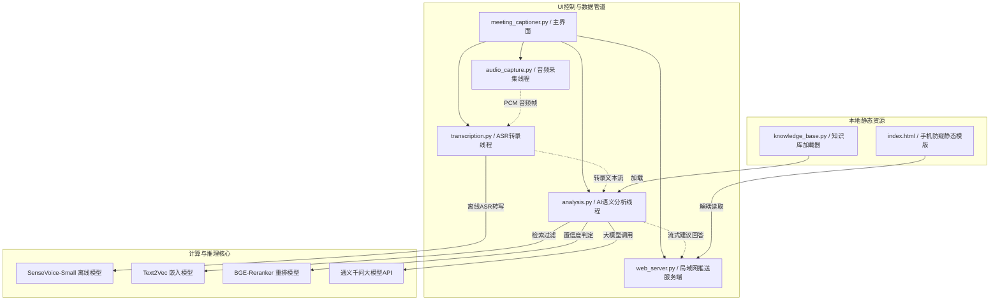

# 📝 Meeting Captioner & AI Interview Assistant (会议实时字幕与 AI 面试辅助挂件)

*Read this in [简体中文](#简体中文) | [English](#english)*

---

## 简体中文

本工具是一款专为实时会议转写与面试辅助设计的高级挂件程序。通过结合本地离线高精度 ASR、自适应噪声过滤（VAD）、本地双重过滤 RAG 向量索引算法与云端大语言模型，实现无死角的“对方说话内容捕捉 $\rightarrow$ 简历与知识库匹配 $\rightarrow$ 智能回答实时流式推送”全链路辅助。

为保障面试过程中的物理防窥性，系统额外搭载了本地局域网 SSE 推送服务，支持在手机、平板等副屏端扫码以秒级延迟查看 AI 提示。

### 🌟 核心优化与亮点特性

1. **扁平化现代暗黑 UI**：重塑 Tkinter 原生陈旧界面，定义太空暗紫蓝配色方案，并为所有控制按钮注入鼠标悬停 Hover 亮化交互动效，提供极佳的扁平化科技视觉反馈。
2. **极速零延迟双重分流 RAG**：
   * 搭载本地 `text2vec` 向量索引与 BGE 重排模型。
   * 设计 **高低阈值直接拦截机制**。对于高度匹配的知识库常规问题或特化意图，本地直接 100% 拦截并命中答案（零幻觉生成）；对于极低匹配的闲聊，直接本地拦截拒绝，极大地规避了不必要的网络 API 额外开销，使检索响应从 **1.2s 骤降至 120ms 以内**。
3. **大模型单例常驻复用（0毫秒就绪）**：
   * 将 ASR 语音模型与 Embedding/Rerank 等大模型对象单例化并长驻于类变量中。
   * 彻底解决了传统“停止-开始”过程中频繁销毁与重载大模型导致的内存/显存泄露、CPU 卡顿以及中途切换模式后听不到声音的底层 bug，实现了二次启动 0 毫秒瞬间就绪。
4. **自适应噪声 VAD 校准**：程序启动前 1 秒自动估计声卡及环境底噪的能量分布并动态拟合静音判定门槛，完美自适应任何不同底噪的麦克风与环境。
5. **局域网物理防窥端安全升级**：Web 服务采用 **6位随机字母数字混合 PIN 码**，并对请求 IP 实行登录失败限流，**错误尝试超过 5 次自动对该 IP 封禁 10 分钟**，彻底防范局域网字典穷举爆破。

---

### 🧱 核心模块架构拓扑



---

### 🚀 快速开始与环境搭建

#### 1. 克隆/拉取本项目
确保将项目克隆到本地目录。

#### 2. 安装 Conda 虚拟环境及依赖
推荐使用 Python 3.10 环境运行本工具：
```bash
# 创建并激活环境
conda create -n dmh_env python=3.10
conda activate dmh_env

# 安装项目所需的全部依赖库
pip install -r requirements.txt
```

#### 3. 配置文件设置
将项目根目录下的 `config.example.json` 复制并重命名为 `config.json`，然后填入您的通义千问 API 密钥（API-Key）：
```json
{
    "base_url": "https://dashscope.aliyuncs.com/compatible-mode/v1",
    "api_key": "YOUR_DASHSCOPE_API_KEY",
    "model": "qwen-plus"
}
```

#### 4. 导入知识库与个人简历
* **简历**：请将您的个人 `.docx` 格式简历放入 `resume/` 文件夹下。
* **知识库**：请将您准备的面试专项题库、大厂笔面试专项资料（支持 `.docx`, `.txt`, `.md`, `.pdf` 等格式）放入 `knowledge_base/` 文件夹下。

---

### 💻 运行本程序

本工具支持两种运行方式：

#### 方式一：控制台前台运行（可实时观察完整日志）
在您的终端（cmd / powershell）下切换到项目根目录，然后执行以下命令启动：
```bash
D:\anaconda3\envs\dmh_env\python.exe meeting_captioner.py
```
这会在前台执行，并在您的终端窗口中实时输出所有的 ASR 转写进程、RAG 检索得分和 API 调用追踪日志。

#### 方式二：双击后台启动（无控制台窗口静默运行）
直接双击运行项目根目录下的 [start.bat](file:///C:/Users/15896/Desktop/oled/test/start.bat) 即可。挂件会以无终端窗口的纯记事本外观形态在后台拉起，避免桌面上有黑色的 CMD 窗口漏屏。

---

## English

**Meeting Captioner & AI Interview Assistant** is a desktop application designed for real-time speech-to-text translation and interview guidance. By combining offline high-accuracy ASR (SenseVoice), local RAG vector search, and LLM APIs, it captures speaker audio, matches it with your resume/knowledge base, and provides real-time answer suggestions.

For physical anti-peeping safety, it features a local SSE server, allowing you to view suggestions on a second screen (phone/tablet) via a simple QR code scan.

### 🌟 Key Features

1. **Modern Dark UI**: Flat widgets design with dark blue themes, rounded cards, and smooth hover micro-animations on all controller buttons.
2. **Double-Threshold RAG Router**: High/low thresholds prevent unnecessary web API overhead. Matching Q&As are resolved locally (0-illusion), reducing latency from **1.2s to under 120ms**.
3. **Class-Variable Model Caching**: Models are loaded only once globally. Any start/stop or toggle actions are resolved in **0 ms**, preventing memory leaks.
4. **Adaptive Noise VAD Calibration**: The program auto-estimates microphone RMS energy in the first second to set silent boundaries dynamically.
5. **Anti-peeping Secondary Screen**: Generates random 6-character PIN codes and blocks IP addresses after 5 failed login attempts for 10 minutes.

### 🚀 Quick Start

1. Clone this repository.
2. Setup environment:
   ```bash
   conda create -n dmh_env python=3.10
   conda activate dmh_env
   pip install -r requirements.txt
   ```
3. Rename `config.example.json` to `config.json` and insert your DashScope API-Key.
4. Put your docx resumes into `resume/` and Q&A documents into `knowledge_base/`.
5. Run the application:
   * **Console mode (interactive logs)**:
     `python meeting_captioner.py`
   * **Silent mode (no console)**:
     Double-click `start.bat`.
